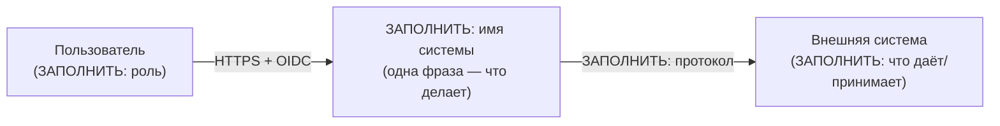
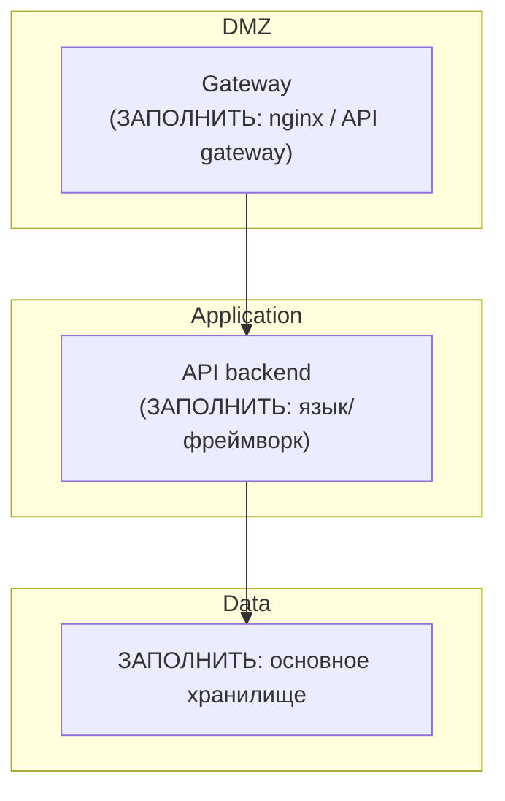

# C4 — контекст и контейнеры

<!-- ЗАПОЛНИТЬ: карта системы на двух уровнях C4 (mermaid, текстом в репо).
     Правило: диаграмма обновляется в том же коммите, что и изменение топологии;
     архитектурно значимые изменения топологии — через ADR (docs/adr/). -->

## System Context (C1 — кому и зачем)

<!-- ЗАПОЛНИТЬ: система как чёрный ящик: пользователи и внешние системы.
     Каждая стрелка — протокол и назначение (например: OIDC, HTTPS/JSON, MCP). -->

## Containers (C2 — из чего состоит)

<!-- ЗАПОЛНИТЬ: деплой-единицы, их технологии и сетевые границы.
     Каждый ящик: имя, технология, ответственность одной строкой.
     Порядок уровней доверия (DMZ/app/data) — отметить подграфами. -->

## Ключевые сценарии

<!-- ЗАПОЛНИТЬ: по мере появления — sequence-диаграммы значимых сценариев
     отдельными файлами: sequence-<сценарий>.md (пример: логин, основной
     пользовательский путь, восстановление после сбоя). Диаграмма нужна там,
     где взаимодействуют 3+ компонента или есть асинхронность. -->
