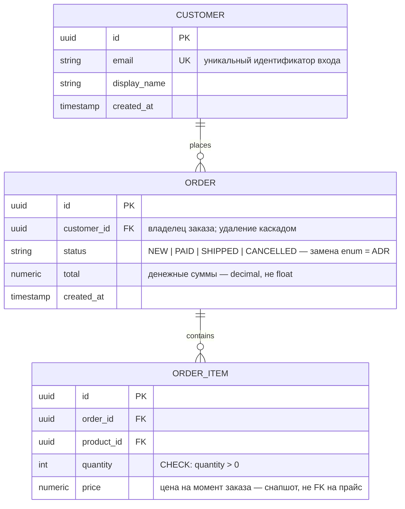

# ER Diagram — модель данных

<!-- ЗАПОЛНИТЬ: каноническая модель данных проекта. Правила:
     - диаграмма хранится текстом (mermaid) — ревьюится в PR, как код;
     - любое изменение схемы = правка этого файла В ТОМ ЖЕ ПР, что и миграция;
       если изменение архитектурно значимо — сначала ADR (docs/adr/);
     - секция «Чтение схемы» объясняет решения, которые НЕ видны из диаграммы:
       инварианты, денормализации, границы владения данными. -->

- **Статус:** каноническая схема (YYYY-MM-DD)
- **Требование:** [из какого документа требование — feature_list.json / ADR / задача]
- **Связанные:** [ADR-00X (решения по хранилищам/доступу), docs/ARCHITECTURE.md §Components]

<!-- ЗАПОЛНИТЬ: заменить сущности-примеры на модель проекта. Соглашения:
     - PK/FK/UK аннотации обязательны; NULL-ность — в комментарии к полю;
     - enum-значения — в комментарии (строки в кавычках);
     - справочник типов ниже можно удалить после заполнения:
       uuid id PK · uuid <сущность>_id FK · string · text · numeric · int · boolean ·
       timestamp · jsonb (полуструктурированные данные) · vector (эмбеддинги) -->

## Чтение схемы

<!-- ЗАПОЛНИТЬ: ключевые решения по данным — то, чего в диаграмме не видно.
     Формат: **тема:** решение + почему. Рекомендуемые темы:
     - границы владения (какая схема/сервис владеет какими таблицами, где запрещён прямой SQL);
     - инварианты записи (что запрещено на уровне конвейера: NULL, записи-сироты без родителя, fail-fast);
     - денормализации (что сознательно дублируется и почему);
     - индексы/производительность (критичные запросы и их индексы);
     - retention/архивация (что и когда удаляется);
     - мультиарендность/изоляция (если применимо — как поле-тенант участвует в каждом запросе). -->

- **[Тема]:** [решение и причина]
- **Инварианты записи:** [...]
